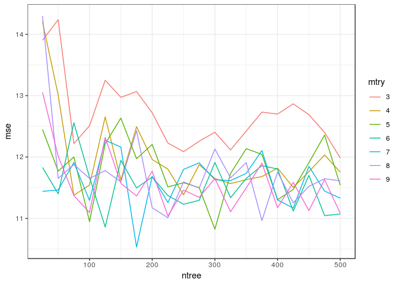
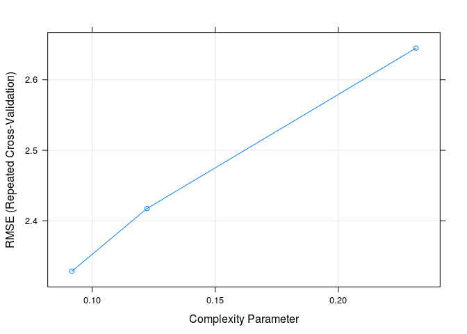

Homework 4: Bags, Forests, Boosts
================
Paul Zhang
2/28/2019

Problem 1
---------

Problem 7 from Chapter 8 in the text. To be specific, please use a sequence of `ntree` from 25 to 500 in steps of 25 and `mtry` from 3 to 9 for by 1.

Answer 1
--------

``` r
set.seed(1234)
df <- tbl_df(Boston)
inTraining <- createDataPartition(df$medv, p = .75, list = F)
training <- df[inTraining, ]
testing  <- df[-inTraining, ]

results <- data_frame(ntree = rep(seq(25, 500, by = 25),each=7),
                      mtry = rep(seq(3, 9),20),
                      mse = rep(NA, length(ntree)))

iters <- rep(seq(25, 500, by = 25))
#for (tree in seq(25, 500, by = 25)) {
for (i in 1:length(iters)) {
  for(n in 1:7){
    rf_boston <- randomForest(medv ~ ., 
                          data = training,
                          mtry = n+2,
                          ntree = iters[i])
    test_preds <- predict(rf_boston, newdata = testing)
    results[(i-1)*7+n,'mse'] <- mean((test_preds - testing$medv)^2)
  }
}
```

``` r
results$mtry <- as.factor(results$mtry)
p <- ggplot(results, aes(x=ntree, y=mse, group=mtry, colour=mtry))
p + geom_line()
```



``` r
#library(doMC)
#set.seed(1234)
#registerDoMC(cores = 4)

#df <- tbl_df(Boston)
#inTraining <- createDataPartition(df$medv, p = .75, list = F)
#training <- df[inTraining, ]
#testing  <- df[-inTraining, ]


#results <- data_frame(ntree = rep(seq(25, 500, by = 25),each=7),
                      #mtry = rep(seq(3, 9),20),
                      #rmse = rep(NA, length(ntree)))

#iters <- rep(seq(25, 500, by = 25))
#for (tree in seq(25, 500, by = 25)) {
#for (i in 1:length(iters)) {
  #rf_boston_cv <- train(medv ~ ., 
                      #data = training,
                      #method = "rf",
                      #ntree = iters[i],
                      #importance = T,
                      #tuneGrid = data.frame(mtry = 3:9))
  #for(n in 1:7){
    #results[(i-1)*7+n,'rmse'] <- rf_boston_cv$results$RMSE[n]
  #}
#}
```

``` r
#results$mtry <- as.factor(results$mtry)
#p <- ggplot(results, aes(x=ntree, y=rmse, group=mtry, colour=mtry))
#p + geom_line()
```

Problem 2
---------

Problem 8 from Chapter 8 in the text. Set your seed with 9823 and split into train/test using 50% of your data in each split. In addition to parts (a) - (e), do the following:

answer
======

``` r
df <- tbl_df(Carseats)
set.seed(9823)
inTraining <- createDataPartition(df$Sales, p = .5, list = F)
training <- df[inTraining, ]
testing  <- df[-inTraining, ]
tree.sales <- rpart(Sales ~ ., data = training)
prp(tree.sales)
```


``` r
test_preds <- predict(tree.sales, newdata = testing)
mean((test_preds - testing$Sales)^2)
```

    ## [1] 4.484515

``` r
set.seed(9823)
train_control <- trainControl(method = "repeatedcv",
                            number = 10, 
                            repeats = 10)
cv_tree <- train(Sales ~ ., data = training,
                            method = "rpart", 
                            trControl = train_control)
```

    ## Warning in nominalTrainWorkflow(x = x, y = y, wts = weights, info =
    ## trainInfo, : There were missing values in resampled performance measures.

``` r
plot(cv_tree)
```



``` r
plot(as.party(cv_tree$finalModel))
```


``` r
test_preds <- predict(cv_tree, newdata = testing)
mean((test_preds - testing$Sales)^2)
```

    ## [1] 6.170433

the test MSE increases compared with the previous model.

``` r
set.seed(9823)
bag.sales <- randomForest(Sales ~ ., data = training, 
                             mtry = 10, 
                             ntree = 500, 
                             importance = TRUE)

test_preds <- predict(bag.sales, newdata = testing)
mean((test_preds - testing$Sales)^2)
```

    ## [1] 3.01177

the test MSE decreases a lot from 4.48 to 3.01.

``` r
importance(bag.sales)
```

    ##               %IncMSE IncNodePurity
    ## CompPrice   20.587848    142.721202
    ## Income       9.476194    123.715622
    ## Advertising 15.743572    118.451406
    ## Population  -4.625454     48.428628
    ## Price       46.087547    341.367435
    ## ShelveLoc   53.562929    496.853257
    ## Age         13.019286    100.936149
    ## Education    6.448361     53.197764
    ## Urban       -2.416301      6.824931
    ## US           5.936722     18.035103

among those variables, ShelveLoc and Price are the most important variables.

``` r
set.seed(9823)
for(i in 3:9){
  bag.sales <- randomForest(Sales ~ ., data = training, 
                             mtry = i, 
                             ntree = 500, 
                             importance = TRUE)

  test_preds <- predict(bag.sales, newdata = testing)
  mse <- mean((test_preds - testing$Sales)^2)
  cat(sprintf('mtry: %s, mse: %s\n', i, round(mse,2)))
}
```

    ## mtry: 3, mse: 3.57
    ## mtry: 4, mse: 3.28
    ## mtry: 5, mse: 3.19
    ## mtry: 6, mse: 3.16
    ## mtry: 7, mse: 3.01
    ## mtry: 8, mse: 3.04
    ## mtry: 9, mse: 3.06

for mtry = 7, the test mse is the smallest.

``` r
set.seed(9823)
bag.sales <- randomForest(Sales ~ ., data = training, 
                             mtry = 7, 
                             ntree = 500, 
                             importance = TRUE)
importance(bag.sales)
```

    ##                %IncMSE IncNodePurity
    ## CompPrice   19.2849524    144.086403
    ## Income       8.3058963    115.092535
    ## Advertising 13.6953251    128.064284
    ## Population  -2.4675494     65.002975
    ## Price       47.5833690    334.670586
    ## ShelveLoc   49.0411045    476.151528
    ## Age         12.5094331    115.084056
    ## Education    6.3032162     51.789768
    ## Urban       -0.5207769      7.807398
    ## US           4.8109066     16.184945

still, ShelveLoc and Price are the most important variables.

answer
======

1.  Fit a gradient-boosted tree to the training data and report the estimated test MSE.

``` r
set.seed(9823)
grid <- expand.grid(interaction.depth = c(1:3), 
                    n.trees = seq(100, 1000, by = 50),
                    shrinkage = c(.01, 0.001),
                    n.minobsinnode = 10)

trainControl <- trainControl(method = "cv", number = 5)

gbm_sales <- train(Sales ~ ., 
                    data = training,
                    trControl = trainControl,
                    method = "gbm",
                    tuneGrid = grid,
                    verbose = FALSE)

test_preds <- predict(gbm_sales, newdata = testing)
mean((test_preds - testing$Sales)^2)
```

    ## [1] 1.811154

1.  Fit a multiple regression model to the training data and report the estimated test MSE

``` r
set.seed(9823)
trainControl <- trainControl(method = "cv", number = 5)
lm_sales <- train(Sales ~ ., 
                    data = training,
                    trControl = trainControl,
                    method = "lm")

test_preds <- predict(lm_sales, newdata = testing)
mean((test_preds - testing$Sales)^2)
```

    ## [1] 1.012709

1.  Summarize your results.

multiple regression model has a better testing MSE than the GBM tree. this means simple model sometimes has a better result.
